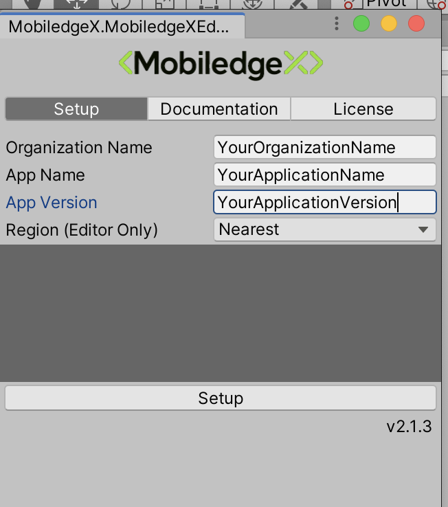

# Edge-Mutiplay NodeJS Server
EdgeMultiplay is a light game server sample that works with [EdgeMultiplay Unity Client](https://github.com/mobiledgex/edge-multiplay-unity-client), the server is built using NodeJS

## Documentation

Checkout the server documentation [here](https://mobiledgex.github.io/edge-multiplay-node-server/)

## Prequesites

- **[MobiledgeX Unity SDK](https://github.com/mobiledgex/edge-cloud-sdk-unity)**
- **EdgeMultiplay Unity Client**

### EdgeMultiplay Unity Client Tutorials : https://www.youtube.com/watch?v=9kMz6Q3g0xQ&list=PLwUZZfaECSv18E5d0ooDR7S8416pImW8W


## Usage

Download EdgeMultiplay Module from npm
```
npm install edge-multiplay
```
Example of Usage
```
const edgeMultiplay = require('edge-multiplay')

edgeMultiplay.wsServer.on('newConnection',(path, connection)=>{
  // your logic goes here 
  // On success call
  edgeMultiplay.addToLobby(connection)
  // On failure call edgeMultiplay.rejectConnection(connection)
})
```

#### For Running the server on your machine 

On the Unity Client change the following:

- In EdgeManager check Use Local Host Server
- Specify the Host IP Address


#### For Deploying your server to MobiledgeX Console

- In the Makedefs file, set the following parameters

```
ORG_NAME ?= Your Organization Name
APP_NAME ?= Your Application Name
APP_VERS ?= Your Application Version

```

- then in the command line  run this command ``` make ```

This should add your server's docker image  to MobiledgeX registery and MobiledgeX docker hub

- Create an app using the docker image and spawn your app instance on MobiledgeX Console
  
  
  For more info on how to define your Application on MobiledgeX Console, check https://www.youtube.com/watch?v=YorMXIi4J9c
  
On the Unity Client change the following:

- In Unity Editor, Click MobiledgeX/Setup
- Set your Organization Name, Application Name, Application Version and click Setup


