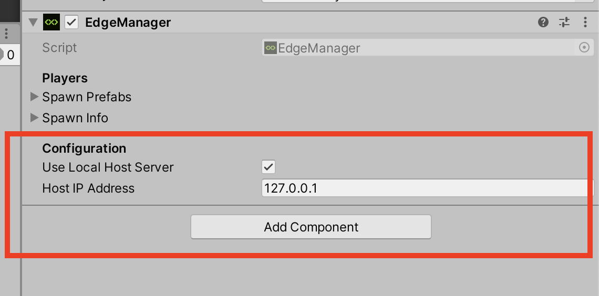

<a href="https://twitter.com/intent/follow?screen_name=mobiledgex">

</a>
 <a href="https://discord.gg/k22WcfMFZ3">

</a>


# Edge-Mutiplay NodeJS Server
EdgeMultiplay is an open source multiplayer game server that works with [EdgeMultiplay Unity Client](https://github.com/mobiledgex/edge-multiplay-unity-client). The server is built using NodeJS and we provide a ready made client written in C# Unity.

## Documentation

For more information on how to use the server, please refer to the server documentation [here](https://mobiledgex.github.io/edge-multiplay-node-server/)

## Prerequisites

- **[MobiledgeX Unity SDK](https://github.com/mobiledgex/edge-cloud-sdk-unity)**
- **EdgeMultiplay Unity Client**

## EdgeMultiplay Unity Client Tutorials

[](https://www.youtube.com/watch?v=9kMz6Q3g0xQ&list=PLwUZZfaECSv18E5d0ooDR7S8416pImW8W)


## [Discord server](https://discord.gg/CHCWfgrxh6)

## Usage

### Using npm:

Download EdgeMultiplay Module from npm
```
npm install edge-multiplay
```
Example of Usage
```
const edgeMultiplay = require('edge-multiplay')() //you can specify your ports here see example.js

edgeMultiplay.wsServer.on('newConnection',(path, connection)=>{
  // your logic goes here 
  // On success call
  edgeMultiplay.addToLobby(connection)
  // On failure call edgeMultiplay.rejectConnection(connection)
})
```


### Using docker: 
```
docker pull mobiledgexsamples/edge-multiplay
```

```
docker run -d -p 3000:3000 -p 7776:7776 -p 5000:5000/udp mobiledgexsamples/edge-multiplay
```


### Unity client configuration to run locally:

- In EdgeManager check Use Local Host Server
- Specify the Host IP Address



For more information on how to run the server locally, please refer to our [setup guide](https://developers.mobiledgex.com/t/625988aa) on the MobiledgeX Developer Portal. 

* For bug reports or contributions please check the [github repo](https://github.com/mobiledgex/edge-multiplay-node-server), and join the [discord server](https://discord.com/invite/CHCWfgrxh6)
